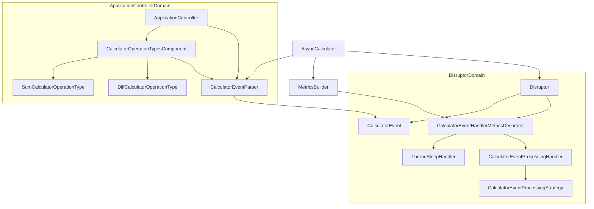

# Async Calculator based on the Disruptor pattern

## Interaction between classes high-level scheme



## Usage example
Using the command line, it is possible to specify three arguments.

Input example:
```Shell
./AsyncCalculator.exe "1,Sum,5,3" "2,Diff,5,3" "3,Mult,5,3"
```
- The first value is the operation ID.
- The second value is the operation shorthand (Sum, Diff, Mult, … )
- The third and fourth values are the operation arguments.

Output example:
```Shell
Operation Id: 1, Code: Success, Result: 8
Operation Id: 2, Code: Success, Result: 2
Operation Id: 3, Code: OperationNotFound, Result:
Calculation time metrics:
Operation Id: 1, Handler: ThreadSleepHandler, ProcessingTime: 2002ms
Operation Id: 1, Handler: CalculatorEventProcessingHandler, ProcessingTime: 8ms
Operation Id: 2, Handler: ThreadSleepHandler, ProcessingTime: 2001ms
Operation Id: 2, Handler: CalculatorEventProcessingHandler, ProcessingTime: 1ms
Operation Id: 3, Handler: ThreadSleepHandler, ProcessingTime: 2003ms
Operation Id: 3, Handler: CalculatorEventProcessingHandler, ProcessingTime: 0ms
```


